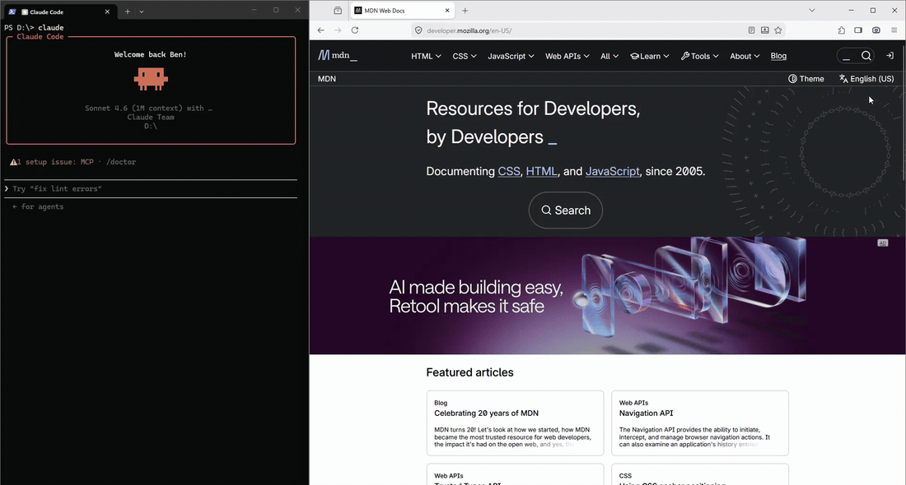

<p align="center">
  
</p>

<p align="center">
  <a href="https://github.com/bgaze/snapstack-server/actions/workflows/ci.yml"></a>
  <a href="LICENSE"></a>
  = 18">
  <a href="https://modelcontextprotocol.io"></a>
  
  <a href="https://www.npmjs.com/package/snapstack-server"></a>
  <a href="https://www.npmjs.com/package/snapstack-server"></a>
</p>

<p align="center">
  
</p>

The **SnapStack server** is a single always-on Node process: it receives browser captures from the
[extension](https://github.com/bgaze/snapstack-extension), stacks them on disk, and serves them to any
MCP-capable LLM client over **Streamable HTTP**. It listens only on `127.0.0.1` — nothing ever leaves your machine.

> **New here?** The full install + usage guide lives in the **extension README**:
> **[snapstack-extension](https://github.com/bgaze/snapstack-extension)**. This page is the technical reference.

## Architecture

One always-on process serves both the extension (capture) and your MCP client, decoupled by a folder on disk.

```
[MV3 extension]  --POST /push (bytes)-->  ┐
                                          ▼
                            [SnapStack server]   127.0.0.1:4123
                               ├─ writes ─►  ~/.snapstack/   (stack on disk)
                               └─ MCP /mcp (HTTP)  ◄── MCP client
```

- **Capture** — the extension encodes the shot as WebP (PNG fallback), downscales it, and POSTs it here.
- **Stack** — one image file (`.webp`/`.png`) plus a twin `.json` (url, title, timestamp, dimensions) per capture,
  named `NN <timestamp>`: a stable two-digit **number** (assigned in capture order, restarts at `01` when the stack
  empties) plus a timestamp, under `~/.snapstack/`.
- **Retrieval** — `get_screenshots` returns a JSON **manifest** (number, absolute path, dimensions, metadata —
  *no image bytes*); the client reads only the files it needs, by path. Deletion is a separate, explicit
  `clear_screenshots` step. **Retrieval never deletes.**

## Requirements

- **Node.js ≥ 18** (tested on Node 20). No git needed at runtime.
- An **MCP-capable LLM client** speaking the **HTTP** (Streamable HTTP) or **stdio** transport.
- The **[snapstack-extension](https://github.com/bgaze/snapstack-extension)** loaded in your browser.

## Install & run

Run it once in the foreground:

```bash
npx -y snapstack-server@latest        # → SnapStack server listening on http://127.0.0.1:4123
```

For start-at-login + crash-restart + self-update, install the auto-start unit (launchd on macOS, systemd `--user` on
Linux, a logon scheduled task on Windows):

```bash
npx -y snapstack-server@latest install     # register auto-start; uninstall with `… uninstall`
```

The unit runs a best-effort `npm install --prefix <appDir> snapstack-server@latest` then launches the locally installed
copy — so the server self-updates on each (re)start, and still starts offline once installed. No git involved.

The full end-to-end walkthrough (idiomatic install paths, MCP client registration, the extension) is in the
**[extension README](https://github.com/bgaze/snapstack-extension)**.

## MCP

SnapStack speaks two MCP transports over the same on-disk stack — pick whichever your client supports:

```jsonc
// HTTP (server already running) — register http://127.0.0.1:4123/mcp; copy deploy/mcp.json
{ "type": "http", "url": "http://127.0.0.1:4123/mcp" }
```
```jsonc
// stdio (the client spawns the process)
{ "command": "npx", "args": ["-y", "-p", "snapstack-server", "snapstack-mcp"] }
```

The HTTP `/mcp` endpoint is **stateless** (a fresh server + transport per request); the stdio front-end (`snapstack-mcp`)
is spawned on demand and reads the same `~/.snapstack` stack. Capture intake (`/push`) always stays in the running
server, independent of either MCP front-end.

### Exposed tools

| Tool                | Description                                                                                                                                                                          |
|---------------------|--------------------------------------------------------------------------------------------------------------------------------------------------------------------------------------|
| `get_screenshots`   | Lists pending captures as a JSON manifest (stable number, absolute path, dimensions, metadata) — **no image bytes, no deletion**. Pass `numbers` (e.g. `[1,3]`) to list only those. |
| `clear_screenshots` | Deletes captures. Pass `numbers` to delete specific ones; omit to clear the whole stack. Numbering restarts at `01` once empty.                                                      |
| `count_screenshots` | Number of pending captures, without retrieving them.                                                                                                                                |

`get_screenshots` and `count_screenshots` are **read-only**; only `clear_screenshots` is **destructive**. To run a
tool without a per-call confirmation, add its identifier to your client's allow-list (for Claude Code:
`mcp__snapstack__<tool>` in `permissions.allow`).

> **Token cost**: `get_screenshots` returns only the manifest, so it stays cheap whatever the stack size — the client
> then reads just the files it needs. WebP + downscaling keep those reads light.

## Configuration

### Environment variables (infrastructure)

| Variable         | Default        | Purpose                                 |
|------------------|----------------|-----------------------------------------|
| `SNAPSTACK_DIR`  | `~/.snapstack` | Stack folder.                           |
| `SNAPSTACK_PORT` | `4123`         | Listening port (always on `127.0.0.1`). |

### Capture policy (shared across your browsers)

The encoding/capture settings are **owned by the server** and stored in `~/.snapstack/config.json`, so a single
edit applies to **every browser** running the extension. They are edited from the extension's **options page** — not
an environment variable — and fetched by the extension before each capture.

| Key         | Default | Meaning                                              |
|-------------|---------|------------------------------------------------------|
| `format`    | `webp`  | Image format: `webp`, `png` or `jpg`.                |
| `quality`   | `0.85`  | Lossy quality (`0`–`1`; the extension UI shows it as a percentage). |
| `maxWidth`  | `1568`  | Downscale captures wider than this to this width in px (`0` = no resize). |
| `maxSlices` | `50`    | Full-page capture: hard cap on stitched slices.      |

Two endpoints back it: `GET /config` returns the effective policy; `POST /config` validates and replaces it (host- +
CORS-guarded like every capture route). The file is a non-image, so a stack clear never touches it; deleting it just
restores the defaults above.

## Troubleshooting

- **"Capture server not started"** (in the extension): start the server (`npm start`) or check the auto-start.
  Test: `curl http://127.0.0.1:4123/health`.
- **Port already in use** (`EADDRINUSE`): set `SNAPSTACK_PORT` to another value.
- **The client doesn't see the tools**: the server must run **before** the MCP client starts; check the config
  (`type: "http"`, correct URL). Direct test: `curl http://127.0.0.1:4123/count`.
- **Inspect the stack**: `ls ~/.snapstack` (image files + human-readable `.json`).

## License

MIT — see [LICENSE](./LICENSE).
